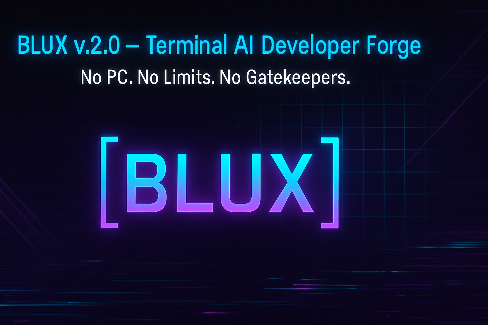

<p align="center">
  
</p>

<p align="center">
  <b>"Your Mind. Your Machine. Your Reality."</b>
</p>


# ⚡️ BLUX v2.0 – The Sovereign Android AI Forge ⚡️

**"Your Mind. Your Machine. Your Reality."**

> ```*Create. Innovate. Never Destroy.*```

By: ~JADIS

---

## 📚 Table of Contents

- [What is BLUX v2.0?](#-what-is-blux-v20)
- [Features](#-features)
- [Responsible Use Statement](#-responsible-use-statement)
- [Installation](#-installation)
  - [Install Termux (Android 10+)](#1-install-termux-android-10)
  - [Clone the Repository](#2-clone-the-repository)
  - [Set Your Hugging Face Token](#3-set-your-hugging-face-token-for-model-downloads)
  - [Run the Installer](#4-run-the-installer)
  - [Switch Models](#5-switch-models-anytime)
- [Model Benchmarking](#-model-benchmarking)
- [Plugin Marketplace](#-plugin-marketplace)
- [Acode IDE Integration](#-acode-ide-integration)
- [BLUX Terminal Theme](#-blux-terminal-theme)
- [Author Authenticity](#-author-authenticity)
- [Troubleshooting](#-troubleshooting)
- [How to Test BLUX v2.0](#-how-to-test-blux-v20)
- [Code Quality: PEP 8 Compliance](#-code-quality-pep-8-compliance)
- [Final Words](#-final-words)
- [Contributors Wanted! Join the BLUX v2.0 Terminal AI Forge](#-contributors-wanted-join-the-blux-v20-terminal-ai-forge)
- [Sponsor](https://github.com/Justadudeinspace/blux#sponsor)

---

## 🔥 What is BLUX v2.0?

**BLUX v2.0** is a fully offline, AI-powered, terminal-based development forge for Android.

> ```No PC. No subscriptions. No limits.```

- Harness the power of local LLMs, voice, automation, and scripting—right on your device.
- Designed for creators, tinkerers, and visionaries who demand control and privacy.

---

## 🚀 Features

- **100% Offline AI:** Run models like DeepSeek, Phi-2, TinyLlama, and more—no cloud required.
- **Model Switcher:** Instantly swap between installed AI models.
- **Model Benchmarking:** Test speed and memory usage on your device.
- **Plugin System:** Drop in new AI or automation modules with ease.
- **Plugin Marketplace:** Discover and install plugins from a growing community registry.
- **Voice Control:** Full offline speech-to-text and TTS (coming soon).
- **Automation:** Integrate with Termux, Tasker, and system scripting.
- **Acode IDE Integration:** Launch a full-featured Android code editor for a true IDE experience.
- **Author Authenticity:** All releases are GPG-signed by JADIS for security and trust.

---

## ⚠️ Responsible Use Statement

> BLUX is a tool for creation and innovation.  
> **It is NOT intended for malicious use.**  
> I do not support hacking, destruction, or harm.  
> Use BLUX to build, learn, and push boundaries—never to destroy.

---

## 📦 Installation

### 1. Install Termux (Android 10+)

- **Via F-Droid:**  
  Download [Termux from F-Droid](https://f-droid.org/packages/com.termux/).

- **Via GitHub Releases:**  
  Download the latest `.apk` from [Termux GitHub Releases](https://github.com/termux/termux-app/releases).

### 2. Clone the Repository

```
git clone https://github.com/Justadudeinspace/blux.git
cd blux
```

### 3. Set Your Hugging Face Token (for model downloads)

```
export HF_TOKEN=your_huggingface_token
```

### 4. Run the Installer

```
bash scripts/install.sh
```


### 5. Switch Models Anytime

```
bash scripts/switch_model.sh
```


---

## 🧪 Model Benchmarking

Test all installed models for speed and memory usage:

```
bash scripts/benchmark_models.sh
```


---

## 🔌 Plugin Marketplace

Discover and install plugins:

```
python scripts/install_plugin.py
```


- Browse available plugins in `plugins/registry.json`

- Install new plugins instantly

---

## 🖥️ Acode IDE Integration

- BLUX will prompt you to install and launch [Acode](https://play.google.com/store/apps/details?id=com.foxdebug.acode) for full IDE capabilities.
- Edit, debug, and manage code directly on your device.

---

## 🎨 BLUX Terminal Theme

- Upon install, your Termux terminal is themed with the BLUX logo and a custom color prompt for a unique developer experience.

---

## 🔑 Author Authenticity

All official BLUX releases are signed with my GPG key.

To verify:

```
gpg --import blux_author_pubkey.asc
gpg --verify blux_v2_xda_ready.sig blux_v2_xda_ready.zip
```


---

## 🛠️ Troubleshooting

- **Model not found:**  
  - Run `bash scripts/switch_model.sh` and select a valid model.
- **Model download fails:**  
  - Ensure your Hugging Face token is set and valid.
- **Plugin not loading:**  
  - Check for syntax errors or missing dependencies in the plugin file.
- **Update BLUX:**  
  - Run `bash scripts/update.sh`.

---

## 🧪 How to Test BLUX v2.0

1. **Run the main app:**

    ```
    python3 -m blux.blux
    ```
    - Enter a prompt and verify AI response.

2. **Switch models:**

    ```
    bash scripts/switch_model.sh
    python blux/blux.py
    ```
    - Ensure the new model responds.

3. **Benchmark models:**

    ```
    bash scripts/benchmark_models.sh
    ```
    - Check logs for speed/memory.

4. **Install a plugin:**

    ```
    python scripts/install_plugin.py
    python blux/blux.py
    ```
    - Ensure plugin output appears.

5. **Check Termux theming:**
    - Open a new Termux session and verify BLUX logo and prompt.

6. **Test Acode integration:**
    - Open Acode and edit files in your BLUX repo.

---

## 🧹 Code Quality: PEP 8 Compliance

- **Install flake8:**
    ```
    pip install flake8
    ```
- **Run flake8 on the blux directory:**
    ```
    flake8 blux/
    ```
- **Fix any reported issues for clean, professional code.**

---

## 💬 Final Words

BLUX v2.0 is for the visionaries, the outcasts, and the creators who refuse to accept “impossible.”

> ```Let’s build the future—one line of code at a time.```

---

## 🚀 Contributors Wanted!

- Join the BLUX v2.0 Terminal AI Forge

> Are you a coder, creator, Android modder, AI enthusiast, or a visionary who refuses to accept “impossible”?  
BLUX v2.0 needs radical collaborators!

> We’re looking for passionate contributors to help shape the future of offline, modular, open-source AI on Android and Linux.

### **Collaboration Means:**
- Working on cutting-edge terminal AI tools
- Building and testing plugins (like the TWRP Builder)
- Pushing the boundaries of what’s possible on Android and Linux
- Learning, teaching, and creating together—no matter your background

> Sound like your kind of rebellion?

**Reach out and join the BLUX Forge today!**

Let’s build something legendary.

> ```**Your mind. Your machine. Your reality.**```

To get started, fork the repo, open an issue, or just say hi!

# Sponsor

"Support 'BLUX, The Sovereign Android AI Developer Forge' & Other Future Projects by Sponsoring [~JADIS @ Patreon](patreon.com/Justadudeinspace)

